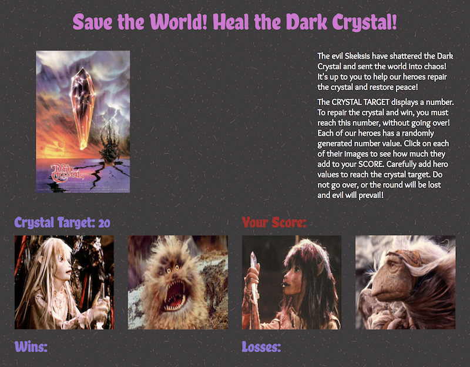

<h1 align="center">week-4-game: Heal the Dark Crystal!</h1>
<!-- App Description -->

JavaScript game featuring jQuery.

 

## Technologies Used
JavaScript, jQuery, CSS, Bootstrap CSS

### Deployed Link
[GitHub] https://g33klaura.github.io/week-4-game/

### Key Features
* Functions using JavaScript Math methods to generate random numbers for each game round
* Hover effect on character/hero images

### Screenshots

###### Main view of the game

### Game Process
* The evil Skeksis have shattered the Dark Crystal and sent the world into chaos! It's up to you to help our heroes repair the crystal and restore peace!

<!--  -->

* The CRYSTAL TARGET displays a number. To repair the crystal and win, you must reach this number, without going over! 
* Each of our heroes has a randomly generated number value. 
* Click on each of their images to see how much they add to your SCORE. 
* Carefully add hero values to reach the crystal target. 
* Do not go over, or the round will be lost and evil will prevail!
