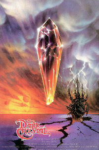

<h1 align="center">Heal the Dark Crystal!</h1>

JavaScript and jQuery game to save the world

 

## Deployed Application

[GitHub] <https://g33klaura.github.io/week-4-game/>

## Concept

The evil Skeksis have shattered the Dark Crystal and sent the world into chaos! It's up to you to help our heroes repair the crystal and restore peace!

## Technologies Used

JavaScript, jQuery, Bootstrap CSS, HTML

## Key Features

* Functions using JavaScript Math methods to generate random numbers for each game round
* Hover effect on character/hero images

### Application Process

1. The "Crystal Target" displays a number. To repair the crystal and win, you must reach this number, without going over!
1. Each of our heroes is assigned a randomly generated number value
1. Click on each hero and note how much they add to "Your Score"
1. Carefully continue to click on heros, add value to your score, and reach the crystal target value
1. Do not go over, or the round will be lost and evil will prevail!

### Screenshots

###### Game in action

###### Heroes and score-keeping text

:gem: :gem: :gem: